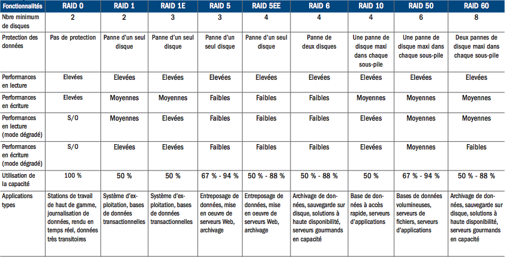
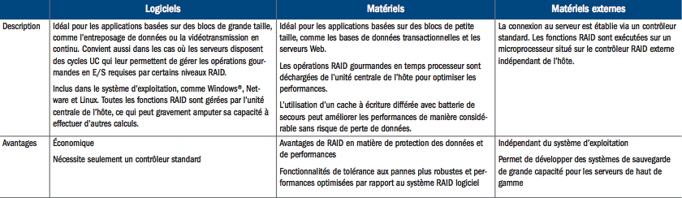

# Disque dur

<u>Recommandé :</u>

- Un disque pour le système d'exploitation et l'application 4D Server

- Un disque SSD ultra performant pour la base de données 4D

- Un disque SSD de capacité suffisante pour le fichier d'historique
  courant et les sauvegardes (.journal, .4BK et .4BL)

Les avantages de disposer de 3 disques distincts :

- En cas d'incident majeur avec le disque système : aucun impact sur
  les données et les sauvegardes, vous réinstallez le système sur un
  nouveau disque et vous rattachez les 2 disques SSD

- En cas d'incident majeur avec le disque contenant la base de données
  4D ou en cas de corruption des données : restaurer la dernière
  sauvegarde et intégrer le journal courant présents sur le disque des
  sauvegardes

- En cas d'incident majeur avec le disque contenant les sauvegardes :
  créer une nouvelle sauvegarde de la base de données et un nouveau
  fichier d'historique sur un nouveau disque SSD

Pour améliorer la tolérance aux pannes, la sécurité et les performances
de l'ensemble, la mise en place d'un système RAID est un très bon
choix :

- pour la base de données : le meilleur choix est le RAID 10 (sécurité
  et performances),

- pour les sauvegardes : le meilleur choix est le RAID 5 (prix et
  sécurité).

Vous trouverez ci-dessous un comparatif des différents niveaux de RAID
suivi des types de système RAID. Ce tableau n'a pas été réalisé par 4D
mais je trouve qu'il résume bien ce qu'il faut savoir sur le RAID.

# 

# 

#
